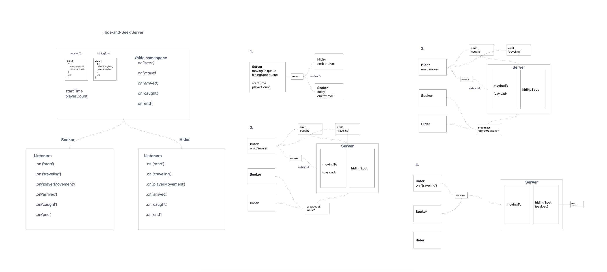

# hide-n-seek

## Contributors

* Laurel Perkins
* Jonathan Tsai
* Daniel Yoon

## Description

This is a Socket.io powered client and server application that allows users to play a game of hide-n-seek. 

## Whiteboard

## Functionality

* The game is played in a "stage" with 10 hiding spots.
* 1 Player is picked as a Seeker and the others are Hiders.
* When the game starts, all players can begin moving to their chosen hiding spots.
* If a Seeker finds a player at a hiding spot, they are caught.
* If a Hider encounters a Seeker while traveling to a hiding spot, they are caught.
* When any player - Hider or Seeker - moves, the rest of the players are notified that movement is happening.

## Installation

* Clone the repository onto your local machine.
* Run npm install to install dependencies.

## How to start Demo

* Start the server by running "node server" on the terminal.
* Once the server is running, use "node client" on a second terminal to have a player connect and hide.
* Run a third terminal with "node client" to have a seeker connect and catch the hider.
